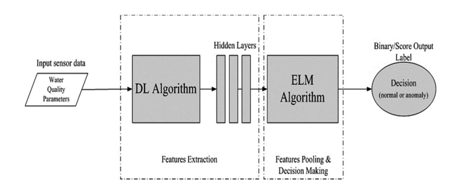

### Water Quality Anomaly Detection

Hybrid CNN-ELM implementation of water quality anomaly detection.

* Though CNN and ELM are related in their underlying architecture which is a Neural Network, both of them differ significantly in concepts.

* ELMs are Single Hidden Layer Feed Forward Networks , where their first weight matrix are randomly initialised and they learn only at the last layer. Hence, ELMs have an advantage of faster computation and reduced learning time.

* In CNNs all the layers learn and this greedy approach ensures joint optimisation.But due to gradient-descent adjustment process it is computationally slower.

* So we exploit the advantages of CNN and ELM to perform better.
* CNN is used to extract features and ELM pools the features and makes the final decision.
